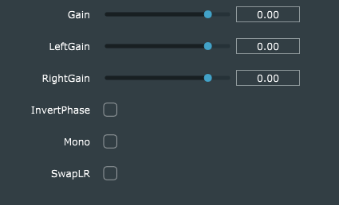

# Description

A simple plugin made with JUCE with the following features:
* overall gain slider
* left channel gain slider
* right channel gain slider
* button to invert phase
* button to toggle mono
* button to swap the left and right channels

# Build
At the moment, the plugin should be built using the [Projucer](https://juce.com/discover/projucer).

---

Note: Only expected to work for 2 input and 2 output channels. Not tested for other combinations.
